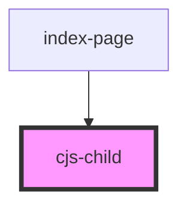

# cjs-child

<!-- Auto Generated Below -->

## Properties

| Property            | Attribute             | Description | Type     | Default     |
| ------------------- | --------------------- | ----------- | -------- | ----------- |
| `messageFromFather` | `message-from-father` |             | `string` | `undefined` |

## Events

| Event   | Description | Type               |
| ------- | ----------- | ------------------ |
| `reply` |             | `CustomEvent<any>` |

## Methods

### `setPaga(money: number) => Promise<void>`

#### Returns

Type: `Promise<void>`

## Dependencies

### Used by

 - [index-page](../index-page)

### Graph

----------------------------------------------

*Built with [StencilJS](https://stenciljs.com/)*
