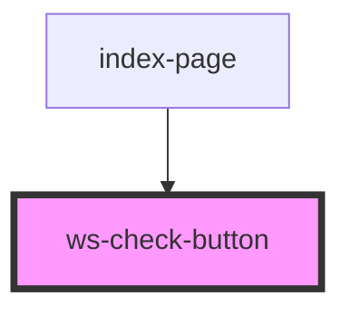

# ws-check-button

<!-- Auto Generated Below -->

## Properties

| Property    | Attribute    | Description | Type      | Default     |
| ----------- | ------------ | ----------- | --------- | ----------- |
| `idCheck`   | `id-check`   |             | `string`  | `undefined` |
| `isChecked` | `is-checked` |             | `boolean` | `false`     |
| `nameCheck` | `name-check` |             | `string`  | `undefined` |
| `text`      | `text`       |             | `string`  | `undefined` |

## Events

| Event           | Description | Type               |
| --------------- | ----------- | ------------------ |
| `checkedChange` |             | `CustomEvent<any>` |

## CSS Custom Properties

| Name                                          | Description |
| --------------------------------------------- | ----------- |
| `--ws-check-button-background-color`          |             |
| `--ws-check-button-border`                    |             |
| `--ws-check-button-color`                     |             |
| `--ws-check-button-height`                    |             |
| `--ws-check-button-selected-background-color` |             |
| `--ws-check-button-selected-border`           |             |
| `--ws-check-button-selected-color`            |             |
| `--ws-check-button-width`                     |             |
| `--ws-check-buttton-font-size`                |             |

## Dependencies

### Used by

 - [index-page](../index-page)

### Graph

----------------------------------------------

*Built with [StencilJS](https://stenciljs.com/)*
